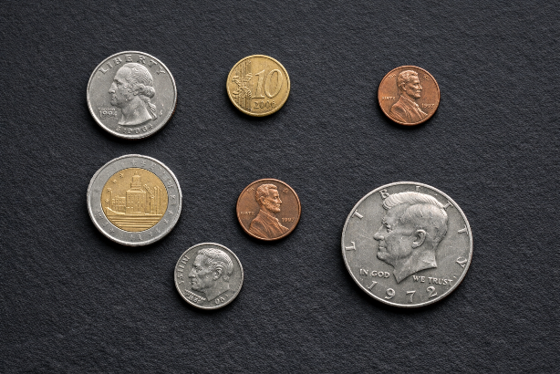
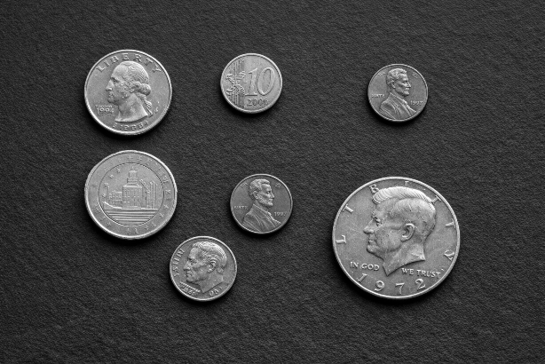
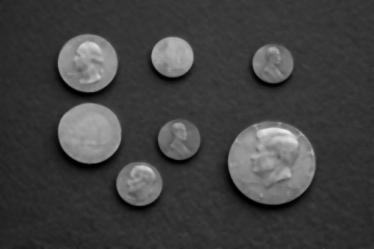
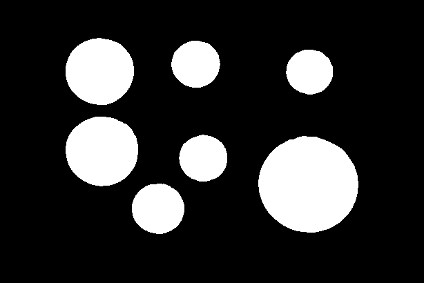
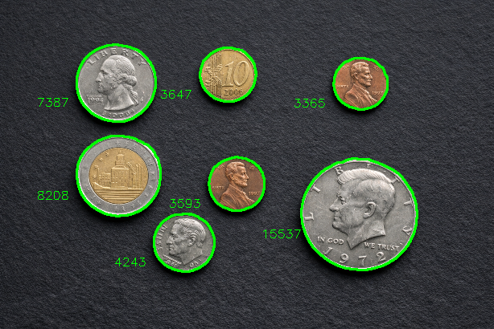

# Coin Recognition

## Overview

- In this project, a photo of several coins is entered, and as a result, the coins are identified and their area is written next to each coin.

## Objective

- The goal of this project is to learn the cv2 library to get started with machine vision learning.

## Project stages
Explanation of steps and skills:

### Step one

- We upload the photo.
- We reduce the size of the image by 60%.

### Step two

- We make the photo gray.

### Step three

- We blur the photo so that the edges of the coins are visible.

### Step four

- We split the photo into two parts so that the location of the coins is clear.

### Step five

- Then we find the coordinates of the coins and mark them.
- Finally, the area of ​​each coin is calculated and written in the lower left corner of each coin.
